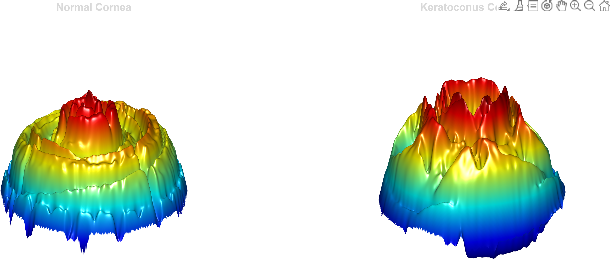

# Keratoconus AI + 3D Visualization

This project demonstrates an AI-based pipeline for detecting Keratoconus from corneal topography images, combined with a 3D visualization for better interpretation.

---

## 🧠 Project Overview

- Classification of corneal images:
  - Normal
  - Keratoconus

- Model:
  - ResNet18 (PyTorch)

- Explainability:
  - Grad-CAM visualization

- Visualization:
  - MATLAB-based 3D surface reconstruction

---

## 📊 Results

### 3D Comparison

### Sample Inputs

---

## 🔬 Methodology

1. Image preprocessing
2. Model training (ResNet18)
3. Evaluation (Accuracy, F1-score)
4. Grad-CAM visualization
5. 3D surface reconstruction using MATLAB

---

## 🛠️ Technologies Used

- Python (PyTorch)
- MATLAB
- OpenCV
- NumPy
- Matplotlib

---

## 📁 Project Structure

- `keratoconus-detection.ipynb` → AI model
- `Eye_code.m` → MATLAB 3D visualization
- `results/` → Output images

---

## 🚀 Future Improvements

- Use real elevation data instead of RGB mapping
- Deploy as web app
- Add interactive 3D visualization

---

## 👨‍💻 Author

Abdulrhman
